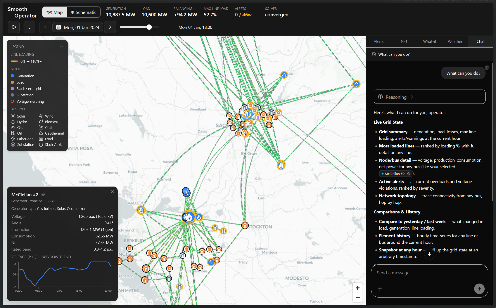
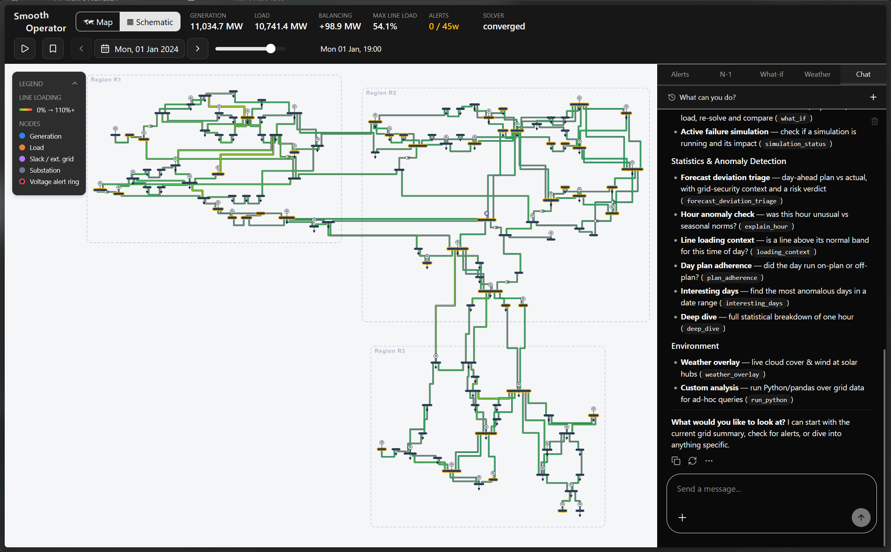
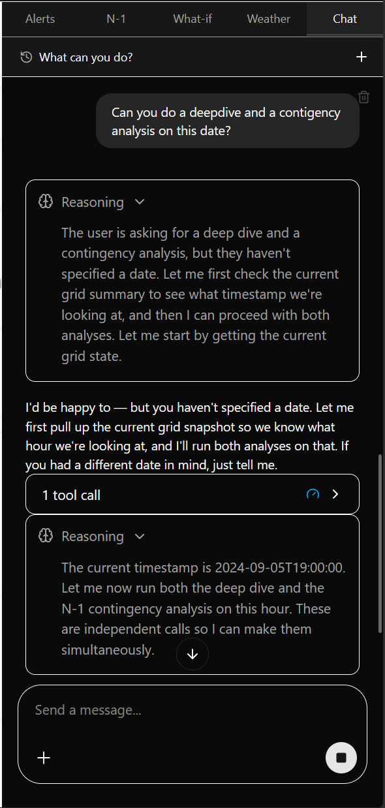
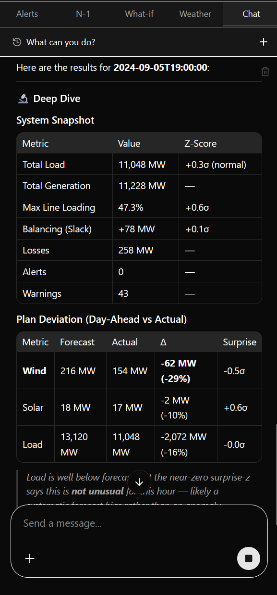
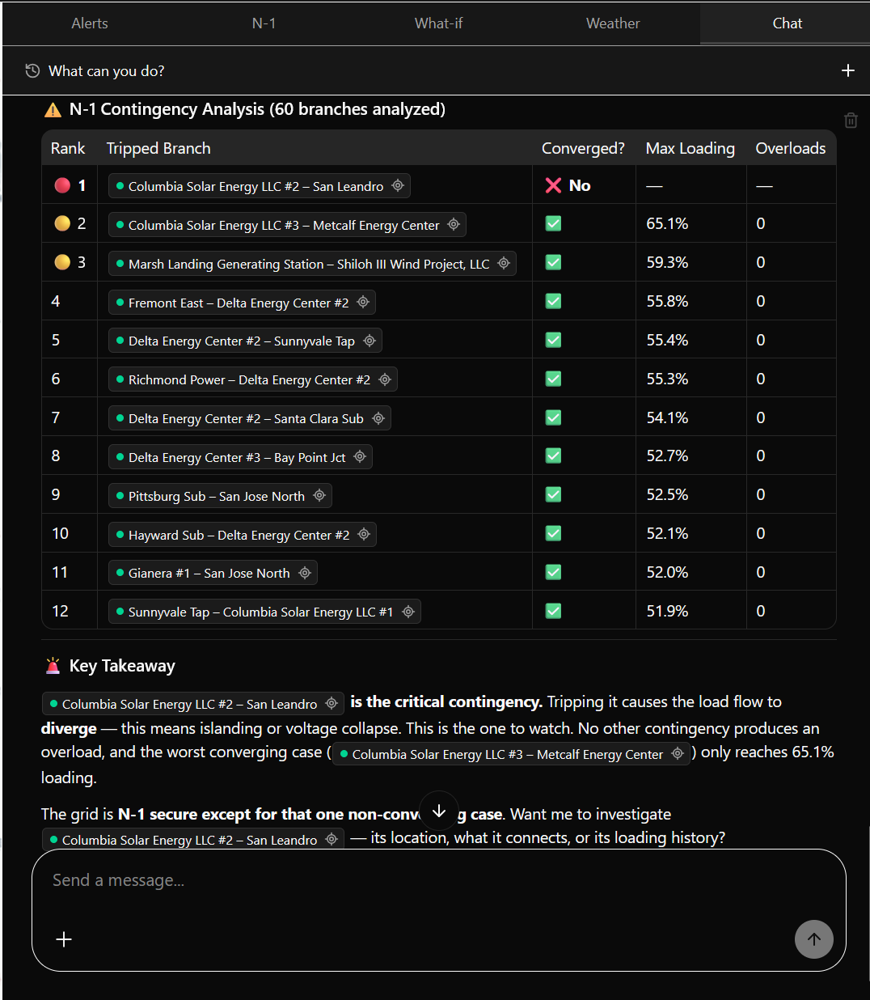

# Smooth Operator: real-time decision support for transmission grids

**ČEPS · GreenHack 2026 - Grid Pulse Challenge.**

A map-based view of the power transmission grid that turns raw load-flow data
into operational insight for control-room dispatchers. The challenge is to make
the grid legible while operators work under time pressure: what is the state
right now, what does it mean, and what is about to break. This submission is the
1st place winner of [GreenHack 2026](https://web.archive.org/web/20260608130230/https://www.greenhack.eu/) hackathon.

> See [`docs/Grid Pulse Challenge.pdf`](docs/Grid%20Pulse%20Challenge.pdf) for
> the full challenge brief.



---

## What it does

- **Map-based grid view**: 118 substations and 186 branches (lines and
  transformers) on a live map of California. Lines are coloured by loading
  (green → amber → red); nodes are typed by role (generation / load /
  substation / slack) and sized by power.
- **Real load flow**: AC power flow ([pandapower](https://www.pandapower.org/))
  solved on demand for any hour of 2024 (8760 hourly snapshots).
- **Detail panels**: click any node or line to see its static ratings, live
  values, and a windowed time-series chart.
- **Threshold alerts**: line overloads and voltages checked against each bus's
  rated band.
- **Time scrubber / "pulse"**: play through the hourly window. The map and KPIs
  animate as the state evolves.
- **What-if scenarios**: disconnect a line or scale load, re-solve, and see
  which branches move (and which overload) against the base case. Simulate a
  dire disaster.
- **N-1 security analysis**: trip each line, re-solve, and rank the worst
  contingencies. Non-converging trips are flagged as islanding or voltage
  collapse.
- **Dispatcher chatbot**: a natural-language, tool-calling agent grounded in the
  live grid state, via any OpenAI-compatible endpoint (OpenRouter by default).

---

## Screenshots

The same system state shown two ways. One is a geographic map, the other an
engineer's single-line diagram. The dispatcher agent is docked on the right in
both.



<p align="center"><em>Schematic view: the same hour as a single-line diagram, alongside the agent's anomaly-detection and analysis tools.</em></p>

### The dispatcher agent in action

It reasons, calls the same engine the UI uses (load flow, N-1, deep-dive
statistics), and narrates grounded results rather than free-form guesses.

<table>
  <tr>
    <td width="50%" valign="top"></td>
    <td width="50%" valign="top"></td>
  </tr>
  <tr>
    <td align="center"><em>Ask once. It infers the hour and fans out parallel tool calls.</em></td>
    <td align="center"><em>It returns a grounded deep-dive: snapshot plus plan deviation, with z-scores.</em></td>
  </tr>
</table>

<p align="center">
  
</p>

<p align="center"><em>N-1 contingency analysis: every line tripped and ranked, with the one critical (non-converging) contingency called out.</em></p>

---

## Repository layout

| Path | What it is |
|------|------------|
| [`src/`](src/) | **The application.** A FastAPI + pandapower backend ([`src/backend/`](src/backend/)) and a React / TypeScript / MapLibre frontend ([`src/frontend/`](src/frontend/)), plus [`src/deploy/`](src/deploy/) (rehost helper) and [`src/case_study/`](src/case_study/) (early loader prototype). |
| [`dataset/`](dataset/) | The ČEPS IEEE-118 dataset. The `data/` payload (8760 hourly snapshots, static network, forecasts, realtime) is downloaded and gitignored. The version-controlled [`overrides/`](dataset/overrides/) hold operator coordinate/label CSVs and are preserved across dataset updates. |
| [`docs/`](docs/) | Challenge brief (`Grid Pulse Challenge.pdf`), the source `NREL_IEEE_118.pdf`, `dataset_schema.md`, and [`screenshots/`](docs/screenshots/). |
| [`scripts/`](scripts/) | `download_dataset.{sh,ps1}` (fetch the dataset), `run.{sh,ps1}` (one-command local launch), and a quick `analyze_datasets.py`. |
| [`src/case_study/`](src/case_study/) | Early data-exploration / loader prototype that fed the final design. |

---

## Architecture

```
ČEPS dataset (pandapower JSON snapshots + static CSV + forecasts)
        │
   backend/  Python · FastAPI · pandapower · grid engine + AI agent
        │     load flow · N-1 · what-if · weather · chat
        │     canonical model: Node / Line / StateFrame
        ▼
   /api (REST)   ──proxied──▶   frontend/  React · TypeScript · Vite · MapLibre GL
```

The backend is the only component that touches physics or the dataset. The
frontend only ever sees the canonical `Node / Line / StateFrame` model.

**Engine note:** the dataset is native pandapower (`pandapowerNet` JSON,
IEEE-118-derived). Snapshots load with one call (`pp.from_json`), generators are
preserved, and N-1 / what-if run natively.

---

## Quickstart

### One command (recommended)

```bash
./scripts/download_dataset.sh        # or scripts/download_dataset.ps1 on Windows
./scripts/run.sh                     # or scripts/run.ps1 on Windows
```

`run.sh` is a reproducible launcher. It checks for `uv` (or Python 3.12) and
Node/npm, printing exactly what is missing if a dependency isn't installed. Then
it sets up the backend virtualenv and frontend packages, creates
`src/backend/.env` from the example on first run, builds the gridstats bundle
once, and starts the backend (`:8099`) and the Vite dev server (`:5173`). Open
**http://127.0.0.1:5173**. `Ctrl-C` stops both. Re-runs skip work already done.

### Docker (single container)

```bash
docker compose -f docker/docker-compose.ghcr.yml up -d   # prebuilt image from GHCR
# or build locally:
docker compose -f docker/docker-compose.build.yml up --build
# then open http://localhost:8099
```

One `uvicorn` process serves the API and the built UI. The image is lean. On
first start the entrypoint downloads the dataset and builds the gridstats bundle
into persistent volumes, so image updates never re-download them. See
[`docker/README.md`](docker/README.md) for configuration, trace persistence, and
the GitHub Actions → GHCR setup.

### Manual setup

#### 1. Data

Download the dataset into `dataset/data/` (or set `GRID_DATA_DIR` to point at an
inner `data/` directory elsewhere):

```bash
./scripts/download_dataset.sh        # or scripts/download_dataset.ps1 on Windows
```

The backend reads `dataset/data/{snapshots,static,forecasts,realtime}` by
default, plus the version-controlled `dataset/overrides/` alongside it. The
download merges the payload into `dataset/` without touching `overrides/`.

#### 2. Backend (Python 3.12)

```bash
cd src/backend
uv venv --python 3.12 .venv          # or: python3.12 -m venv .venv
source .venv/bin/activate
uv pip install -r requirements.txt   # or: pip install -r requirements.txt
python -m app.gridstats.build        # one-time: precompute the gridstats bundle
./run.sh                             # http://127.0.0.1:8099
```

The `app.gridstats.build` step scans all 8760 snapshots once and writes the
precomputed bundle to `app/gridstats/target/`, which the dispatcher agent serves
from. It only needs to run again if the dataset changes. The one-command
`scripts/run.{sh,ps1}` does this automatically when the bundle is missing.

#### 3. Frontend

```bash
cd src/frontend
npm install
npm run dev                          # http://127.0.0.1:5173
```

Vite proxies `/api` to the backend, so just open **http://127.0.0.1:5173**.

#### 4. Chatbot (optional)

The launcher copies `src/backend/.env.example` to `src/backend/.env` for you.
For the manual path, do it yourself:

```bash
cp src/backend/.env.example src/backend/.env
# set AI_API_KEY (OpenAI-compatible, e.g. OpenRouter):
#   AI_BASE_URL=https://openrouter.ai/api/v1
#   AI_MODEL=anthropic/claude-sonnet-4.5
```

Without a key the chatbot still returns the grounded grid context, so you can
see exactly what the model would be given.

---

## API at a glance

All endpoints are under `/api` (backend on `:8099`).

| Endpoint | Purpose |
|----------|---------|
| `GET /api/health` | liveness + snapshot count |
| `GET /api/meta` | timestamps, bbox, thresholds, suggested questions |
| `GET /api/frame?timestamp=…` | canonical state (nodes + lines + summary) for one hour |
| `GET /api/alerts?timestamp=…` | threshold alerts (loading + voltage) |
| `GET /api/timeseries?…` | one element's metric across a window |
| `GET /api/n1?timestamp=…` | N-1 contingency ranking |
| `POST /api/whatif` | disconnect lines / scale load, diff vs base |
| `GET /api/weather` | cloud cover / wind + solar-drop heuristic |
| `POST /api/agent/stream` | tool-calling dispatcher agent (NDJSON stream) |

---

The dataset is derived from
[evgenytsydenov/ieee118_power_flow_data](https://github.com/evgenytsydenov/ieee118_power_flow_data)
and licensed **[CC-BY-NC-SA 4.0](http://creativecommons.org/licenses/by-nc-sa/4.0/)**
(non-commercial; derivatives under the same licence).