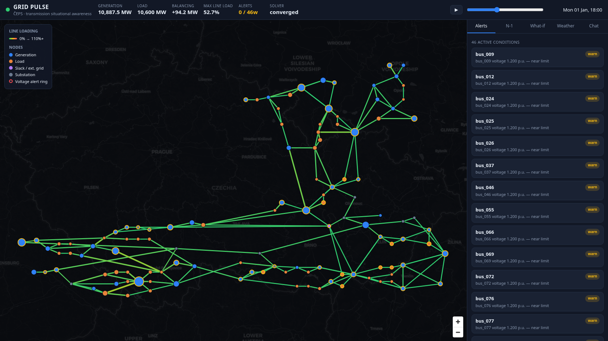

# Grid Pulse — real-time situational awareness for transmission grids

**ČEPS · GreenHack 2026.** An AI-assisted, map-based view of the power transmission
grid that turns raw load-flow data into clear, timely operational insight for
control-room dispatchers. Make the grid **visible**, **understandable**, and
**predictable**.



---

## What it does

- **Map-based grid view** — 118 substations and 186 branches (lines + transformers)
  on a live map of Czechia. Lines are coloured by loading (green → amber → red),
  nodes typed by role (generation / load / substation / slack) and sized by power.
- **Real load flow** — AC power flow (pandapower) solved on demand for any hour of
  2024 (8760 hourly snapshots).
- **Detail panels** — click any node or line for static ratings, live values, and a
  windowed time-series chart.
- **Threshold alerts** — line overloads and voltages against each bus's rated band.
- **Time scrubber / "pulse"** — play through the hourly window; the map and KPIs
  animate as a living system state.
- **What-if scenarios** — disconnect a line / scale load, re-solve, and see exactly
  which branches move (and which overload) versus the base case.
- **N-1 security analysis** — trip each line, re-solve, and rank the worst
  contingencies; non-converging trips are flagged as islanding / voltage collapse.
- **Weather overlay** — live cloud cover & wind (Open-Meteo) at the biggest solar
  hubs, with a clearly-labelled (non-ML) solar-drop heuristic.
- **Dispatcher chatbot** — natural-language Q&A grounded in the live grid state,
  via any OpenAI-compatible endpoint (OpenRouter by default).

---

## Architecture

```
ČEPS dataset (pandapower JSON snapshots + static CSV + forecasts)
        │
   backend/  Python · FastAPI · pandapower            ── grid engine + AI proxy
        │     load flow · N-1 · what-if · weather · chat
        │     canonical model: Node / Line / StateFrame
        ▼
   /api (REST)   ──proxied──▶   frontend/  React · TypeScript · Vite · MapLibre GL
```

The backend is the only component that touches physics or the dataset; the frontend
only ever sees the canonical `Node / Line / StateFrame` model.

### Note on the grid engine (pandapower, not pypowsybl)

The original plan named **pypowsybl**. On inspecting the dataset we found it is
**native pandapower** (`pandapowerNet` JSON, IEEE-118-derived, 8760 hourly frames).
Using pandapower as the engine means snapshots load with one call (`pp.from_json`),
generators are preserved (the power-grid-model converter would have dropped them),
and N-1 / what-if run natively — strictly lower risk than converting to pypowsybl
for no functional gain. See `deliverables.txt` for the full rationale.

---

## Running it

### 1. Data

The dataset is expected (gitignored) at:

```
data/greenhack-2026-ČEPS-dataset/data/{snapshots,static,forecasts,realtime}
```

To use a different location, set `GRID_DATA_DIR` to the inner `data/` directory.

### 2. Backend (Python 3.12)

```bash
cd backend
uv venv --python 3.12 .venv          # or: python3.12 -m venv .venv
source .venv/bin/activate
uv pip install -r requirements.txt   # or: pip install -r requirements.txt
./run.sh                             # http://127.0.0.1:8099
```

First boot warms a frame window (~15 s). pandapower needs Python ≤ 3.12 and
`pandas==2.2.3` (pandas 3.x breaks its load-flow writes).

### 3. Frontend

```bash
cd frontend
npm install
npm run dev                          # http://127.0.0.1:5173
```

Vite proxies `/api` to the backend, so just open **http://127.0.0.1:5173**.

### 4. Chatbot (optional)

```bash
cp backend/.env.example backend/.env
# set AI_API_KEY (OpenAI-compatible, e.g. OpenRouter)
#   AI_BASE_URL=https://openrouter.ai/api/v1
#   AI_MODEL=anthropic/claude-sonnet-4.5
```

Without a key the chatbot still returns the grounded grid context so you can see
exactly what the model would be given.

---

## Scripted demo (5 steps)

1. **Open the map.** Point out the loading-coloured network, the typed nodes, and
   the live KPIs (generation, load, balancing power, max loading, alerts). Press
   **▶** on the scrubber — the grid "pulses" through the evening peak.
2. **Click the busiest line.** The detail panel shows its rating, live flow, and a
   trend chart with the 90 % alert line. Click a generation bus to compare.
3. **Open the *Alerts* tab.** Click a warning — the map focuses that element.
4. **Run *N-1*.** The ranked list shows which single-line trips the grid survives
   and which cause overloads or islanding. Click the worst one — the tripped line
   and resulting overloads light up on the map.
5. **Run a *What-if*.** Disconnect that critical line and push load to ×1.2 →
   re-solve. The panel shows base 57 % → ~85 %, the biggest movers, and any new
   alerts. Finish in the **Chat** tab: ask *"Which lines are most loaded?"*.

---

## Testable deliverables

See **`deliverables.txt`** for every deliverable with a one-line `curl` or UI test.

## Out of scope

No trained ML forecasting / anomaly detection (by design). The "predictive" story
is deterministic physics: N-1 security analysis and what-if load flow, plus a
labelled weather heuristic. Extension points are left where ML would plug in.
